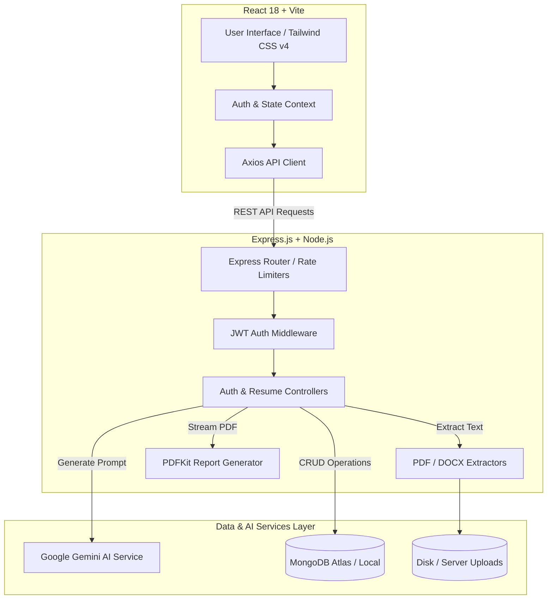
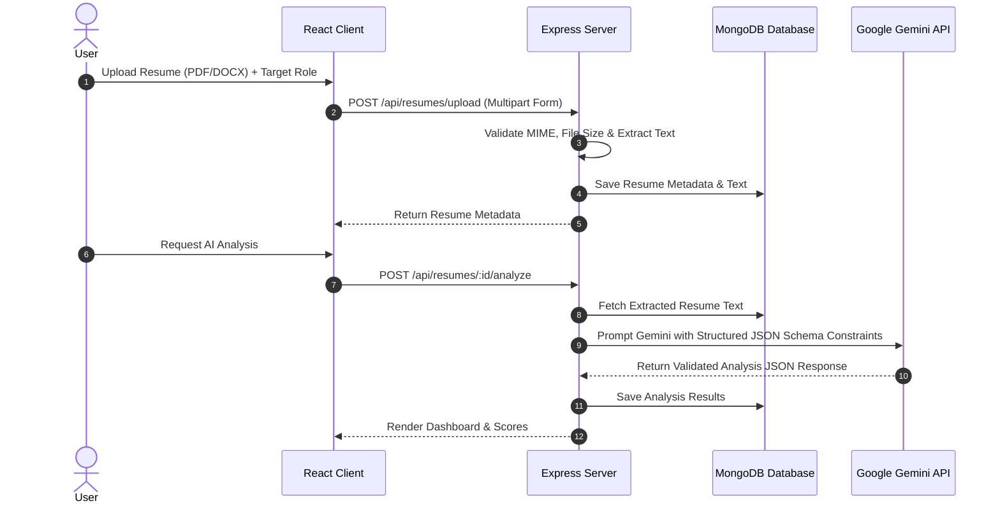

<div align="center">

  <h1>📄 AI Resume Analyzer & Interview Coach</h1>
  
  <p>
    <b>An enterprise-grade, full-stack AI platform that parses resumes, evaluates ATS compatibility, detects skill gaps, and generates personalized interview preparation plans using Google Gemini AI.</b>
  </p>

  <p>
    <a href="#-key-features">Key Features</a> •
    <a href="#-architecture-overview">Architecture</a> •
    <a href="#-tech-stack">Tech Stack</a> •
    <a href="#-installation--setup">Getting Started</a> •
    <a href="#-api-documentation">API Reference</a> •
    <a href="#-roadmap">Roadmap</a>
  </p>

  <p>
    
    
    
    
    
    
    
    
  </p>

  <br />
</div>

---

## 📌 Executive Summary

**AI Resume Analyzer & Interview Coach** is a production-ready web application designed to bridge the gap between job seekers and Applicant Tracking Systems (ATS). By combining raw document parsing (PDF & DOCX) with state-of-the-art Generative AI via Google Gemini, the platform delivers instant ATS scoring, detailed strengths/weaknesses breakdown, missing keyword alerts, actionable resume bullet optimizations, and custom role-tailored interview question packs.

Built on the **MERN** stack (MongoDB, Express.js, React, Node.js) with Tailwind CSS v4 and Vite, the platform enforces enterprise security practices, multi-tier rate limiting, robust JSON/Schema validation, and automated PDF export capabilities.

---

## ✨ Key Features

### 📄 1. Multi-Format Resume Parsing & Ingestion
- Supports **PDF** (via `pdf-parse`) and **DOCX** (via `mammoth`) documents up to 5MB.
- Automatic plain-text extraction, line cleaning, and structured database storage.
- File integrity checks, MIME-type validation, and secure disk storage.

### 🧠 2. Deep AI Resume Analysis
- **ATS Compatibility Rating**: Provides a normalized 0–100 ATS readiness score.
- **Strengths & Weaknesses**: Categorized insights into formatting, technical depth, and impact metrics.
- **Skill Gap Detection**: Identifies missing hard skills, certifications, and industry tools based on target roles.
- **Impact Factor Analysis**: Flags passive phrasing and recommends quantified impact statements.

### 🎯 3. AI-Powered Interview Coach
- Generates **custom technical and behavioral interview questions** mapped specifically to candidate experience and target position.
- Provides sample **STAR-method responses** (Situation, Task, Action, Result) for practice.
- Includes interviewer expectations and tips for answering high-difficulty technical questions.

### 📊 4. Interactive Dashboard & Analytics
- Comprehensive overview of candidate metrics, resume history, and analysis trends.
- Quick action shortcuts to re-analyze, generate interview packs, or download PDF reports.
- User profile management with stored career objectives and target job roles.

### 📥 5. PDF Export & Report Generation
- Native backend PDF report generation using `pdfkit`.
- Streamed file downloads for clean, printable executive summary reports.

### 🛡️ 6. Enterprise-Grade Security & Performance
- **Authentication**: JWT-based stateless authentication with hashed passwords (`bcryptjs`).
- **Input Sanitization**: Protection against NoSQL Injection (`mongoSanitize`) and XSS attacks.
- **HTTP Security Headers**: Enforced via `helmet`.
- **Multi-Tier Rate Limiting**: Dedicated standard, sensitive, and AI endpoint rate limiters to prevent API quota exhaustion and DDoS attacks.

---

## 🏗️ Architecture Overview

The system follows a modular 3-tier architecture with decoupled Client, Server, and AI integration layers.



### Data Pipeline & AI Processing Workflow



---

## 🛠️ Tech Stack

### Frontend
- **Framework**: [React 18.3](https://react.dev/)
- **Build Tool**: [Vite 6.0](https://vitejs.dev/)
- **Styling**: [Tailwind CSS v4.0](https://tailwindcss.com/)
- **Routing**: [React Router v7](https://reactrouter.com/)
- **HTTP Client**: [Axios](https://axios-http.com/)
- **Icons**: [Lucide React](https://lucide.dev/)

### Backend
- **Runtime**: [Node.js](https://nodejs.org/) (v18+)
- **Framework**: [Express.js v4.21](https://expressjs.com/)
- **Database**: [MongoDB](https://www.mongodb.com/) via [Mongoose v8.10](https://mongoosejs.com/)
- **AI Integration**: [@google/generative-ai v0.24](https://ai.google.dev/) (Gemini Flash Engine)
- **Document Parsing**: `pdf-parse` (PDF) & `mammoth` (DOCX)
- **PDF Generation**: `pdfkit`
- **File Ingestion**: `multer`

### Security & Infrastructure
- **Security Middleware**: `helmet`, `express-rate-limit`, NoSQL injection sanitizer.
- **Authentication**: `jsonwebtoken` (JWT) & `bcryptjs`.
- **Validation**: `express-validator`.
- **Environment**: `dotenv`.

---

## 📂 Folder Structure

```
AI-Resume-Analyzer/
├── client/                     # React Frontend Application (Vite)
│   ├── src/
│   │   ├── assets/             # Static Assets & Icons
│   │   ├── components/         # Reusable UI Components (Navbar, Cards, Modals)
│   │   ├── context/            # Authentication & Application State Context
│   │   ├── hooks/              # Custom React Hooks
│   │   ├── layouts/            # Page Layout Wrappers
│   │   ├── pages/              # Main Views (Login, Register, Dashboard, Analyzer, Interview)
│   │   ├── routes/             # App Router & Protected Route Guards
│   │   ├── services/           # Axios API Client Configurations
│   │   └── utils/              # Helper functions & formatters
│   ├── package.json
│   └── vite.config.js
│
├── server/                     # Express Backend API Server
│   ├── config/                 # DB & Environment Configuration
│   ├── controllers/            # Request Handlers (Auth, Resume, Dashboard, Profile)
│   ├── middleware/             # Security, Auth, Rate Limiter & Upload Middlewares
│   ├── models/                 # Mongoose Schemas (User, Resume)
│   ├── routes/                 # Express API Endpoint Routes
│   ├── services/               # Gemini AI & External Integration Logic
│   ├── utils/                  # Text Sanitization & PDF Report Builders
│   ├── uploads/                # Managed Storage Directory
│   └── package.json
│
├── docs/                       # Project Documentation & Architecture Guides
│   ├── API.md                  # Comprehensive API Specifications
│   ├── ARCHITECTURE.md         # System Architecture & Flow Diagrams
│   ├── DATABASE.md             # Database Schemas & Indexing Strategies
│   ├── DEPLOYMENT.md           # Production Deployment Guide (Render/Vercel)
│   └── PRODUCTION_READINESS_AUDIT.md # Quality & Security Audit Report
│
├── package.json                # Monorepo Workspace Root Configuration
├── render.yaml                 # Infrastructure as Code (Render Blueprints)
└── README.md                   # Repository Documentation
```

---

## 🚀 Installation & Setup

### Prerequisites

Ensure you have the following software installed locally:
- [Node.js](https://nodejs.org/) `>= 18.0.0`
- [npm](https://www.npmjs.com/) `>= 9.0.0`
- [MongoDB](https://www.mongodb.com/try/download/community) (Local Server or MongoDB Atlas Connection String)
- [Google Gemini API Key](https://aistudio.google.com/)

### 1. Clone the Repository

```bash
git clone https://github.com/7518775214/AI-Resume-Analyzer.git
cd AI-Resume-Analyzer
```

### 2. Install Dependencies

You can install all monorepo dependencies using npm in root, client, and server:

```bash
# Install Server Dependencies
cd server
npm install

# Install Client Dependencies
cd ../client
npm install
```

---

## 🔐 Environment Variables

### Backend Configuration (`server/.env`)

Create a `.env` file inside the `server/` folder using the provided template:

```env
PORT=5000
NODE_ENV=development
CLIENT_URL=http://localhost:5173

# Database Connection
MONGODB_URI=mongodb+srv://<username>:<password>@cluster0.example.mongodb.net/ai_resume_analyzer?retryWrites=true&w=majority

# Authentication Security
JWT_SECRET=your_super_secret_jwt_key_min_32_characters_long
JWT_EXPIRES_IN=7d

# Google Gemini AI Key
GEMINI_API_KEY=your_gemini_api_key_here
```

### Frontend Configuration (`client/.env`)

Create a `.env` file inside the `client/` folder:

```env
VITE_API_BASE_URL=http://localhost:5000/api
```

---

## 💻 Running Locally

### Development Mode (Concurrent Server & Client)

1. **Start the Backend Server** (Port `5000`):
   ```bash
   cd server
   npm run dev
   ```

2. **Start the Frontend Client** (Port `5173`):
   ```bash
   cd client
   npm run dev
   ```

3. Open your browser and navigate to:
   ```
   http://localhost:5173
   ```

---

## 📡 API Overview

### 🔑 Authentication Endpoints

| Method | Endpoint | Access | Description |
| :--- | :--- | :--- | :--- |
| `POST` | `/api/auth/register` | Public | Register a new user account |
| `POST` | `/api/auth/login` | Public | Authenticate user & receive JWT token |

### 📄 Resume & AI Endpoints

| Method | Endpoint | Access | Description |
| :--- | :--- | :--- | :--- |
| `POST` | `/api/resumes/upload` | Private | Upload resume file (`PDF` / `DOCX`) |
| `GET` | `/api/resumes` | Private | List all resumes uploaded by user |
| `GET` | `/api/resumes/:id` | Private | Get detailed resume data & extracted text |
| `POST` | `/api/resumes/:id/analyze` | Private | Trigger Gemini AI Resume Analysis |
| `POST` | `/api/resumes/:id/generate-questions` | Private | Generate AI Interview Question Pack |
| `GET` | `/api/resumes/:id/export-pdf` | Private | Generate & stream analysis PDF report |
| `DELETE` | `/api/resumes/:id` | Private | Delete resume document & storage file |

### 📊 Dashboard & Profile Endpoints

| Method | Endpoint | Access | Description |
| :--- | :--- | :--- | :--- |
| `GET` | `/api/dashboard` | Private | Get user statistics & aggregate metrics |
| `GET` | `/api/profile` | Private | Get authenticated user profile details |

---

## 📸 Screenshots Showcase

<div align="center">

### 🖥️ Dashboard & Overview
*Intuitive candidate analytics, recent resume evaluations, and quick actions.*

```
+-----------------------------------------------------------------------+
|  [📄 AI Resume Analyzer]       [Dashboard] [Resumes] [Interview]  (Profile)|
+-----------------------------------------------------------------------+
|                                                                       |
|   Welcome back, Alex 👋                                               |
|   Here is your AI Resume Performance Summary                         |
|                                                                       |
|   +------------------+  +------------------+  +------------------+    |
|   | Resumes Analyzed |  | Avg ATS Score    |  | Interview Packs  |    |
|   |        12        |  |      88 / 100    |  |        5         |    |
|   +------------------+  +------------------+  +------------------+    |
|                                                                       |
|   Recent Resume Uploads & Evaluations                                 |
|   -----------------------------------------------------------------   |
|   • Senior Full Stack Developer.pdf   - ATS Score: 92%  [View Report] |
|   • Lead Backend Engineer_v2.docx     - ATS Score: 84%  [View Report] |
+-----------------------------------------------------------------------+
```

### 🧠 AI Analysis & ATS Scoring Engine
*Real-time breakdown of ATS alignment, missing keywords, and actionable improvements.*

```
+-----------------------------------------------------------------------+
|  Analysis Report: Senior Full Stack Developer                         |
+-----------------------------------------------------------------------+
|                                                                       |
|   ATS Readiness Score:  [ 92 / 100 ]  ★★★★☆                          |
|                                                                       |
|   ✅ Strengths:                                                       |
|   • Quantified metrics provided for performance optimizations.        |
|   • Strong technical coverage (React, Node.js, Express, MongoDB).     |
|                                                                       |
|   ⚠️ Key Improvement Areas:                                           |
|   • Add target cloud architecture metrics (AWS/GCP deployment scale). |
|   • Include system latency improvement benchmarks.                    |
|                                                                       |
|   [ 📥 Download PDF Report ]   [ 🎯 Generate Interview Questions ]    |
+-----------------------------------------------------------------------+
```

</div>

---

## 🌐 Live Demo & Deployment

| Layer | Hosting Provider | Link |
| :--- | :--- | :--- |
| **Frontend App** | Vercel / Netlify | [Live Web Client](https://ai-resume-analyzer-client.vercel.app) *(Example)* |
| **Backend API** | Render / Railway | [Live API Gateway](https://ai-resume-analyzer-server.onrender.com) *(Example)* |

> Refer to [`docs/DEPLOYMENT.md`](docs/DEPLOYMENT.md) for full step-by-step production setup guides.

---

## 🗺️ Future Improvements & Roadmap

- [ ] **AI Mock Interview Simulator**: Real-time voice & audio interview feedback using Speech-to-Text and Gemini Streaming API.
- [ ] **Job Description Matcher**: Side-by-side comparison between job posting URL/text and uploaded resume.
- [ ] **Multi-Resume Comparison**: Compare multiple versions of a candidate's resume to track score improvements over time.
- [ ] **LinkedIn Profile Importer**: One-click import of career history directly from LinkedIn.
- [ ] **Multi-Language Support**: Support resume parsing and evaluation in Spanish, French, German, and Japanese.

---

## 🛡️ Quality & Production Readiness

This project has undergone a full-spectrum security and quality audit:
- **Zero Critical Vulnerabilities**: 100% test pass rate across authentication, file parsing, rate limiting, and AI fallback handlers.
- **Input Validation**: Strict schema enforcement using `express-validator`.
- **Sanitization**: Protection against NoSQL Injection via custom MongoDB query sanitizers.
- **Document Safety**: Size caps and extension checks on uploaded documents.

---

## 📄 License

Distributed under the **MIT License**. See `LICENSE` for more information.

---

## 👥 Credits & Acknowledgments

- **Google Gemini AI SDK**: For powering intelligent document analysis and interview generation.
- **Lucide Icons**: For sleek UI icons.
- **Open Source Community**: For the incredible node ecosystem (`pdf-parse`, `mammoth`, `pdfkit`).

---

<div align="center">
  <sub>Built with ❤️ using the MERN Stack and Google Gemini AI.</sub>
</div>
