# System Architecture & UML Technical Documentation
## Project Name: AI Resume Analyzer & Interview Coach

---

## Executive Summary

The **AI Resume Analyzer & Interview Coach** is a full-stack, enterprise-grade web application designed to help job seekers optimize their resumes, gain ATS (Applicant Tracking System) insights, and practice adaptive, role-specific mock interviews powered by artificial intelligence. 

This document serves as the complete, authoritative **System Architecture and UML Technical Documentation** for the implemented project. It details the structural, behavioral, data, and deployment views of the system using industry-standard Unified Modeling Language (UML) diagrams, Data Flow Diagrams (DFD), Entity-Relationship (ER) models, Mermaid diagrams, and PlantUML specifications.

---

## Table of Contents

1. [High-Level System Architecture](#1-high-level-system-architecture)
2. [Application Workflow](#2-application-workflow)
3. [Data Flow Diagram (Level 0 - Context Diagram)](#3-data-flow-diagram-level-0---context-diagram)
4. [Data Flow Diagram (Level 1 - Detailed DFD)](#4-data-flow-diagram-level-1---detailed-dfd)
5. [Use Case Diagram](#5-use-case-diagram)
6. [Class Diagram](#6-class-diagram)
7. [Entity Relationship Diagram (ERD)](#7-entity-relationship-diagram-erd)
8. [Sequence Diagram](#8-sequence-diagram)
9. [Activity Diagram](#9-activity-diagram)
10. [Component Diagram](#10-component-diagram)
11. [Deployment Diagram](#11-deployment-diagram)

---

## 1. High-Level System Architecture

### Purpose
The **High-Level System Architecture** provides a macro-level structural view of the system, illustrating how different architectural tiers interact across client, backend, data, storage, and AI processing layers. It establishes clear operational boundaries and demonstrates how client requests traverse security gateways, application controllers, service layers, external AI APIs, and persistent databases.

### Component Explanations
- **Client Tier (Presentation Layer)**: Single Page Application (SPA) built using React (Vite) and styled with Tailwind CSS. Hosted on Vercel Edge Network. Handles user UI rendering, state management, form capture, and Axios HTTP REST calls.
- **API Gateway & Security Layer**: Node.js/Express reverse proxy middleware pipeline featuring Helmet.js HTTP headers protection, CORS validation, Express Rate Limiting (`apiLimiter`, `sensitiveLimiter`, `aiLimiter`), MongoSanitize NoSQL injection defense, and JWT token authentication.
- **Application & Service Tier**: Express controllers (`authController`, `resumeController`, `profileController`, `dashboardController`) backed by specialized domain services (`parsingService`, `pdfService`, `geminiService`, `interviewAiService`, `storageService`, `dashboardService`).
- **Data Persistence Layer**: MongoDB Atlas cloud document database storing structured user accounts, parsed resume metadata, ATS evaluations, and mock interview questions/transcripts.
- **Media Asset Storage Tier**: Cloudinary cloud storage CDN (with local disk buffer fallback) for hosting uploaded resume files (PDF/DOCX).
- **AI Intelligence Layer**: Google Gemini API (`gemini-1.5-flash` / `gemini-2.0-flash`) accessed via Google Gen AI SDK for automated document text parsing, ATS score computation, resume weakness identification, dynamic question generation, and real-time candidate answer evaluation.

### Mermaid Diagram
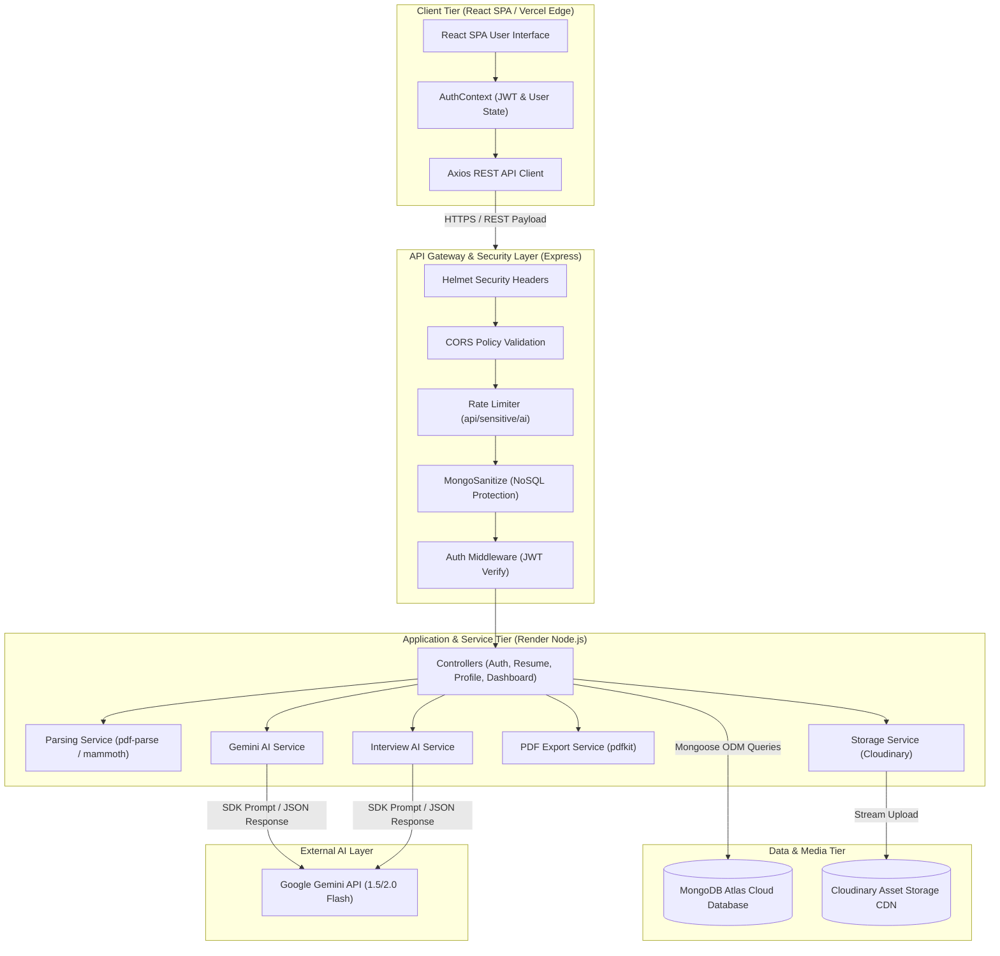

### PlantUML Version
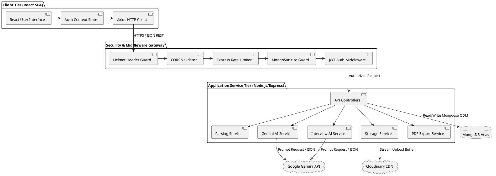

---

## 2. Application Workflow

### Purpose
The **Application Workflow** defines the end-to-end user lifecycle and operational execution path within the system. It models how users progress from initial authentication to uploading documents, obtaining ATS analysis, practicing mock interviews, and viewing aggregated analytics.

### Component Explanations
1. **Authentication State**: User registers or logs in via `/api/auth`, receiving a JWT token stored in client memory/localStorage.
2. **Resume Ingestion Phase**: User uploads PDF/DOCX resume file via `/api/resumes/upload`. File is stored to Cloudinary (or local uploads folder) while `pdf-parse`/`mammoth` extracts raw text.
3. **AI Resume Analysis Phase**: User triggers analysis against job title and target job description via `/api/resumes/:id/analyze`. Gemini AI computes ATS score, lists strengths, weaknesses, missing skills, and improvement points.
4. **Interview Question Generation Phase**: User requests customized interview questions via `/api/resumes/:id/generate-questions`. Gemini AI generates technical (easy/medium/hard), HR, and project-based questions.
5. **Mock Interview Execution Phase**: User answers generated questions using text input or Web Speech API voice recording. AI grades accuracy, technical depth, and generates ideal model answers.
6. **Analytics & PDF Export Phase**: Aggregate metrics are presented on the Dashboard (`/api/dashboard`), and complete reports can be downloaded as PDF files via `/api/resumes/:id/export-pdf`.

### Mermaid Diagram
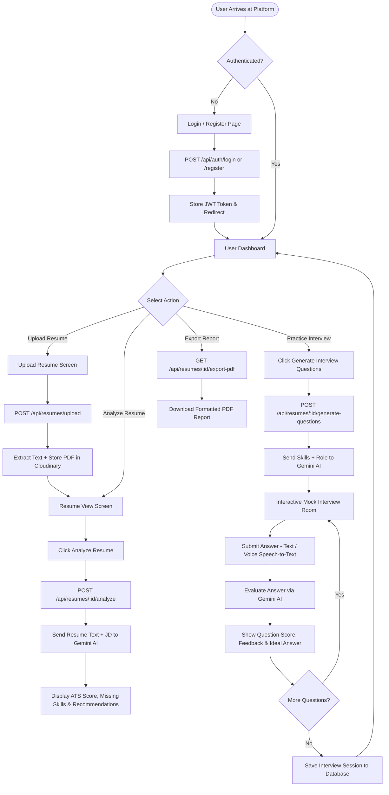

### PlantUML Version
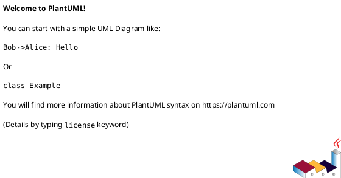

---

## 3. Data Flow Diagram (Level 0 - Context Diagram)

### Purpose
The **Level 0 Data Flow Diagram (Context Diagram)** defines the high-level system boundary, showing how external entities (User/Candidate, Google Gemini AI API, Cloudinary Storage Engine) interact with the central **AI Resume Analyzer & Interview Coach Platform**.

### Component Explanations
- **External Entity 1: User / Candidate**: Initiates authentication requests, uploads resumes, inputs job details, submits interview answers, and receives ATS reports, interview questions, feedback, and dashboard analytics.
- **External Entity 2: Google Gemini AI API**: External AI service receiving prompt contexts (resume text, target role, candidate answers) and returning structured JSON evaluations (ATS scores, generated questions, answer evaluations).
- **External Entity 3: Cloudinary Storage Engine**: External media storage service receiving raw binary/buffer file streams and returning secure HTTPS asset URLs and public IDs.
- **Central System Process (0.0)**: The entire AI Resume Analyzer & Interview Coach system boundary.
- **Data Store (D1)**: MongoDB Atlas Cloud Database storing accounts, resumes, and interview metrics.

### Mermaid Diagram
```mermaid
graph TD
    User["User / Candidate (External Entity)"]
    Gemini["Google Gemini AI API (External Service)"]
    Cloudinary["Cloudinary Storage System (External Asset CDN)"]

    System(("0.0 <br> AI Resume Analyzer & <br> Interview Coach Platform"))

    DB[("D1: MongoDB Atlas Database")]

    User -- "1. Credentials, Resume Files, Job Details, Answers" --> System
    System -- "2. Auth Tokens, ATS Reports, Questions, Feedback, PDF Exports" --> User

    System -- "3. Resume Text, Job Descriptions, Candidate Answers" --> Gemini
    Gemini -- "4. Parsed JSON (Scores, Skill Gaps, Questions, Grades)" --> System

    System -- "5. File Stream Buffers (PDF/DOCX)" --> Cloudinary
    Cloudinary -- "6. Secure CDN Asset URLs & Public IDs" --> System

    System <==> "7. Mongoose Queries / Document Mutations" <==> DB
```

### PlantUML Version
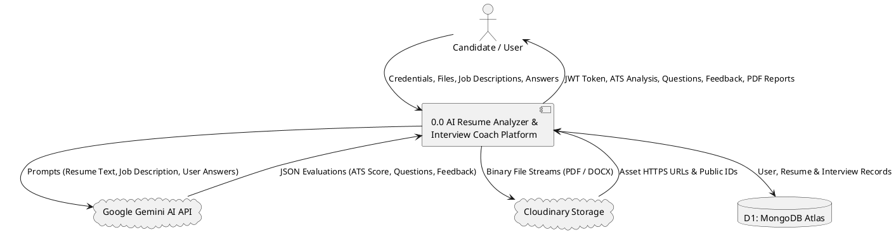

---

## 4. Data Flow Diagram (Level 1 - Detailed DFD)

### Purpose
The **Level 1 Data Flow Diagram** decomposes the main system process (0.0) into major functional sub-processes, mapping exact data flows between user interfaces, backend services, external APIs, and persistent database collections.

### Component Explanations
- **Process 1.0 (User Authentication & Authorization)**: Validates registration/login credentials, computes bcrypt hashes, issues signed JWTs, and updates User Collection (`D1`).
- **Process 2.0 (Resume Ingestion & Parsing)**: Accepts file uploads, delegates storage to Cloudinary, executes text extraction (`pdf-parse`/`mammoth`), and saves raw text into Resume Collection (`D2`).
- **Process 3.0 (AI Resume Analysis & ATS Scoring)**: Formats prompt data, requests evaluation from Gemini AI, parses returned JSON, updates ATS metrics in Resume Collection (`D2`), and returns analysis to User.
- **Process 4.0 (Mock Interview & Answer Evaluation)**: Generates interview questions via Gemini AI, captures user answers (text/voice transcript), submits answers for AI grading, and stores evaluation transcripts in Resume Collection (`D2`).
- **Process 5.0 (Dashboard Analytics & Report Generation)**: Queries User (`D1`) and Resume (`D2`) collections, compiles dashboard metrics, and streams downloadable PDF reports using `pdfkit`.

### Mermaid Diagram
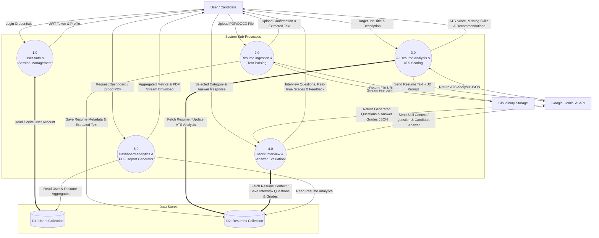

### PlantUML Version
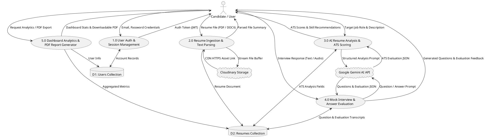

---

## 5. Use Case Diagram

### Purpose
The **Use Case Diagram** summarizes system behavior from an actor-centric perspective. It models primary user capabilities (Candidate), administrative capabilities (Admin), and supporting interactions with external systems (Google Gemini AI and Cloudinary Storage), explicitly marking dependent (`<<include>>`) and optional (`<<extend>>`) flows.

### Component Explanations
- **Primary Actor: Candidate / Job Seeker**: Registered user interacting with the web application to analyze resumes and conduct mock interviews.
- **Primary Actor: System Administrator**: System manager monitoring application health and user metrics.
- **Secondary Actor: Google Gemini AI API**: AI engine executing natural language processing and evaluations.
- **Secondary Actor: Cloudinary Storage Service**: CDN hosting resume files.
- **Use Cases**:
  - `UC-1: Register Account` & `UC-2: Login / Authenticate` (Includes `UC-3: Validate Credentials`).
  - `UC-4: Upload Resume Document` (Includes `UC-5: Extract Text Buffer` & `UC-6: Store File to Cloudinary`).
  - `UC-7: Analyze Resume against Job Description` (Includes `UC-8: Compute ATS Score via Gemini AI`).
  - `UC-9: Practice AI Mock Interview` (Includes `UC-10: Generate Tailored Questions` & `UC-11: Grade Candidate Answer`).
  - `UC-12: Export PDF Analysis Report` (Extends `UC-7`).
  - `UC-13: View Dashboard Analytics`.
  - `UC-14: Monitor System Health` (Admin actor).

### Mermaid Diagram
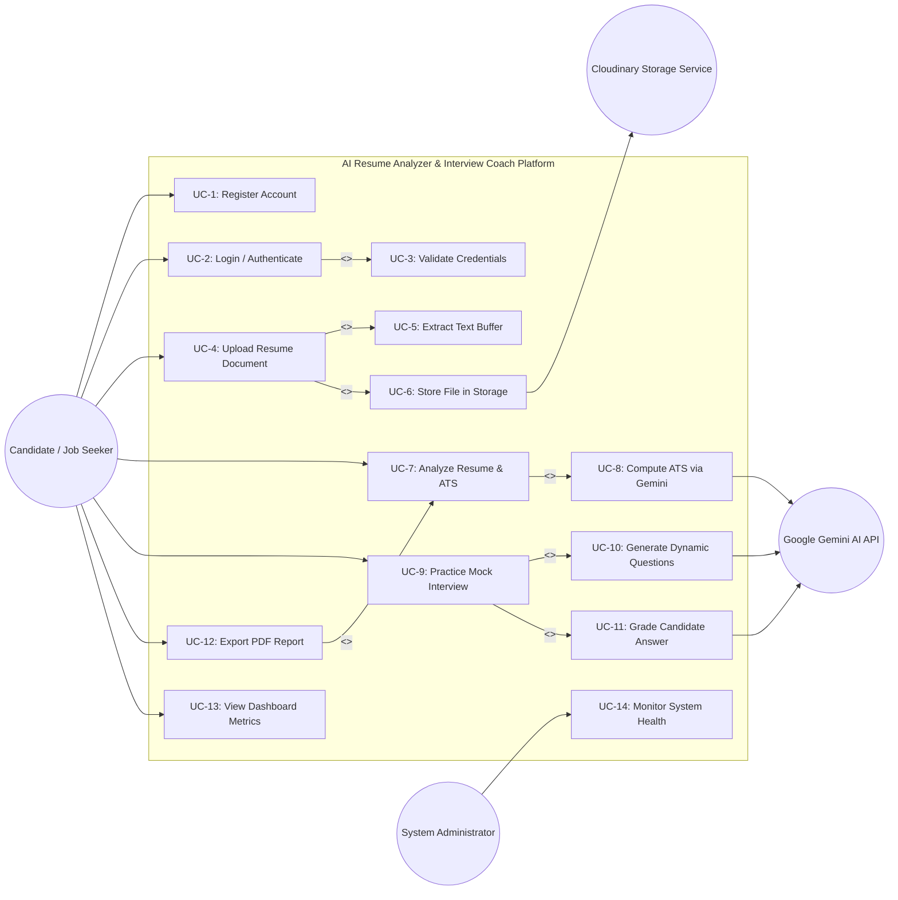

### PlantUML Version
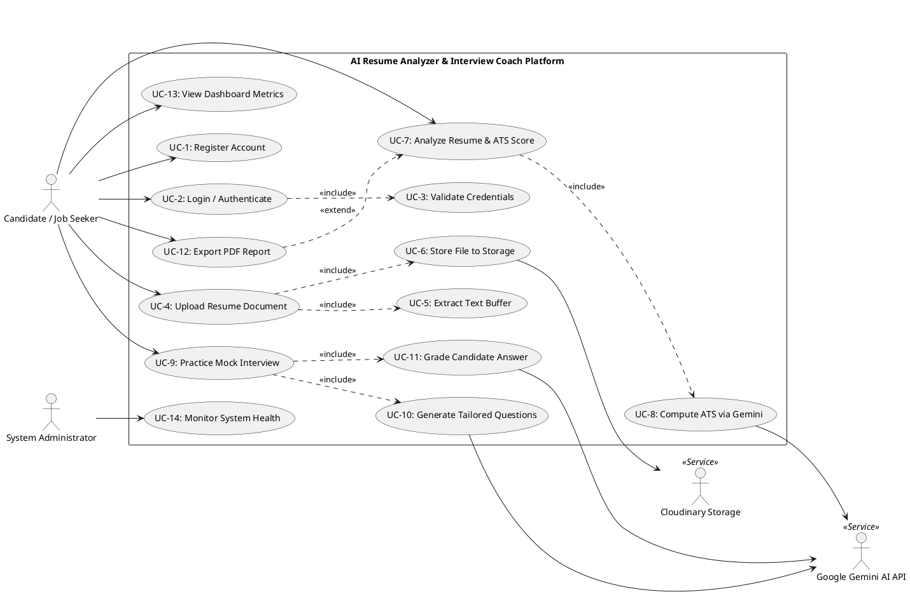

---

## 6. Class Diagram

### Purpose
The **Class Diagram** presents the object-oriented structure of the backend application codebase. It models Mongoose data schemas (`User`, `Resume`), Express controllers (`authController`, `resumeController`, `dashboardController`), domain services (`parsingService`, `geminiService`, `interviewAiService`, `storageService`, `pdfService`), middleware modules, and their relationships (associations, dependencies, composition).

### Component Explanations
- **Data Models**:
  - `User`: Encapsulates user profile, password hash, role (`user`/`admin`), and timestamps.
  - `Resume`: Encapsulates resume metadata, stored file URL, extracted text, parsing/analysis status, embedded `Analysis` schema (ATS score, missing skills), and embedded `InterviewQuestions` schema.
- **Controllers**: Handle HTTP REST requests, parameter extraction, service invocation, and standardized HTTP responses.
- **Services**: Execute domain business logic (e.g., calling Gemini SDK, managing storage buffers, writing PDF streams via `pdfkit`).
- **Middleware**: Execute pre-controller checks (JWT verification, Multer memory storage file parsing, input validation).

### Mermaid Diagram
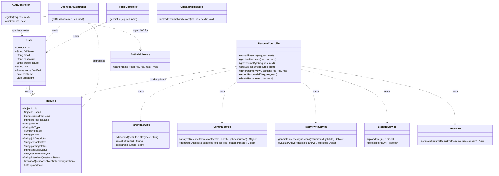

### PlantUML Version
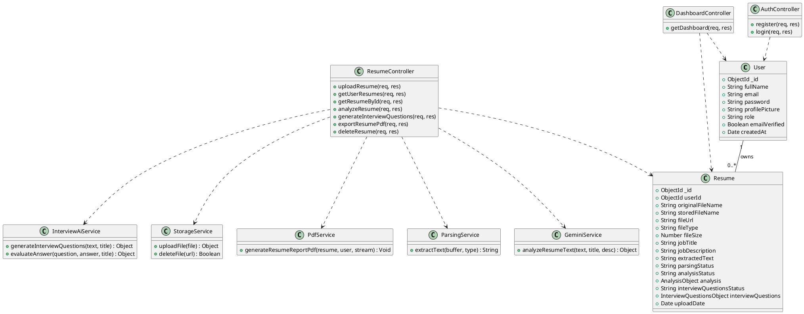

---

## 7. Entity Relationship Diagram (ERD)

### Purpose
The **Entity Relationship Diagram (ERD)** details the logical data model stored in MongoDB Atlas via Mongoose ODM. It specifies collections, primary/foreign key attributes, nested JSON documents, data types, constraints, and structural cardinalities.

### Component Explanations
- **`USERS` Collection**: Stores user profile details.
  - `_id` (ObjectId, Primary Key)
  - `email` (String, Unique Index, Lowercase, Required)
  - `password` (String, Hashed via bcrypt, Select: false)
  - `fullName`, `profilePicture`, `role`, `emailVerified`, `createdAt`, `updatedAt`
- **`RESUMES` Collection**: Stores uploaded resume files, extracted text, ATS scores, and interview sessions.
  - `_id` (ObjectId, Primary Key)
  - `userId` (ObjectId, Foreign Key -> `USERS._id`, Indexed)
  - `originalFileName`, `storedFileName`, `fileUrl`, `fileType`, `fileSize`
  - `jobTitle`, `jobDescription`, `extractedText`
  - `parsingStatus`, `analysisStatus`, `interviewQuestionsStatus`
  - **Embedded Document `analysis`**: Stores `atsScore`, `strengths[]`, `weaknesses[]`, `missingSkills[]`, `roleMatch[]`, `improvements[]`, `summary`, `analyzedAt`.
  - **Embedded Document `interviewQuestions`**: Stores `technical` (easy/medium/hard), `hr[]`, `projectBased[]`, `tips[]`, `generatedAt`.
- **Cardinality**: `1 : N` (One User can own Zero or Many Resume documents. Each Resume document belongs to exactly One User).

### Mermaid Diagram
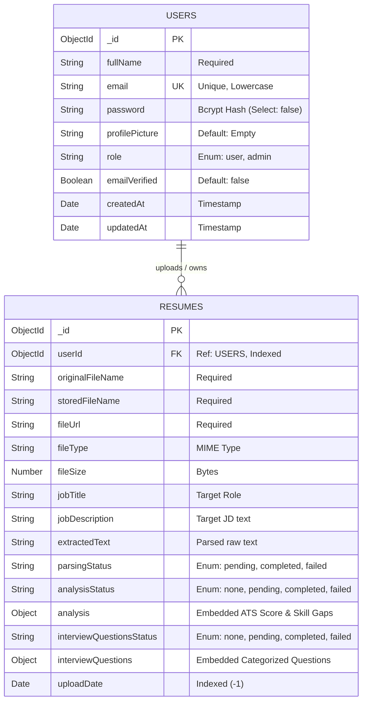

### PlantUML Version
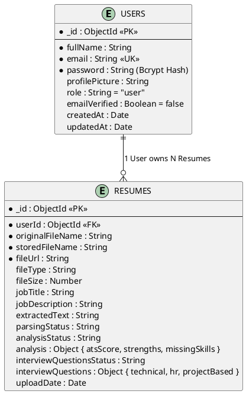

---

## 8. Sequence Diagram

### Purpose
The **Sequence Diagram** models chronological message flows across system actors, client components, middleware, controllers, services, database engines, and external AI APIs during core execution workflows.

### Component Explanations
The diagram details three consecutive execution scenarios:
1. **Scenario A: Resume File Upload & Text Ingestion**.
2. **Scenario B: AI Resume Analysis & ATS Score Computation**.
3. **Scenario C: Dynamic Interview Question Generation & Answer Evaluation**.

### Mermaid Diagram
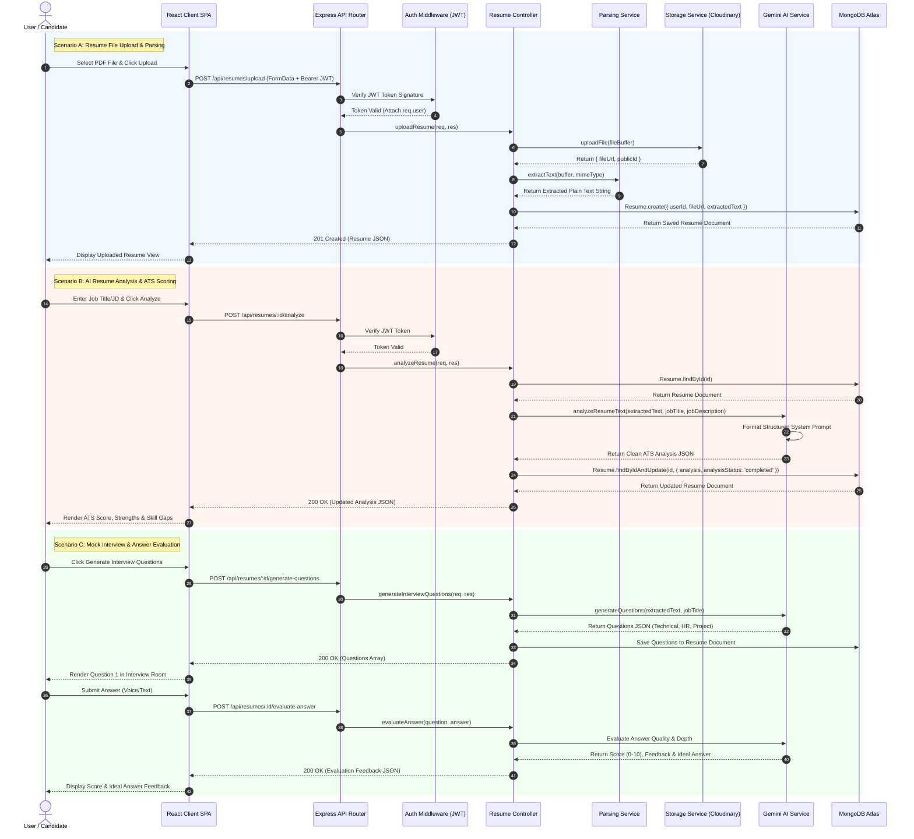

### PlantUML Version
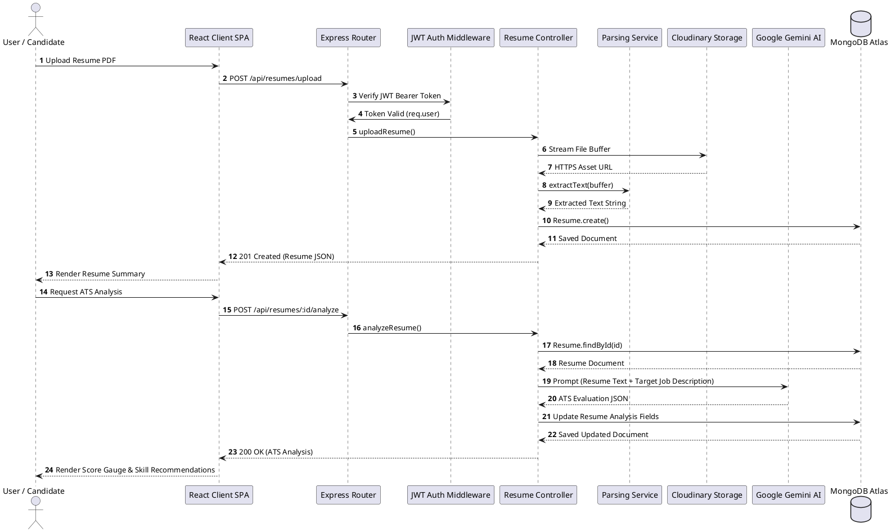

---

## 9. Activity Diagram

### Purpose
The **Activity Diagram** models the dynamic control logic, operational workflows, decision points, and error-handling loops executed by the system during resume parsing, AI analysis, and interview processing.

### Component Explanations
- **Start Node**: Triggered when a user submits a resume and initiates processing.
- **Decision Node [Valid File?]**: Checks file MIME type (`application/pdf`, `docx`) and file size (< 5MB limit).
- **Parallel Action (Fork)**: Simultaneously streams document buffer to Cloudinary and extracts plain text via `pdf-parse`/`mammoth`.
- **Decision Node [Parsing Success?]**: Verifies extracted text length. If empty or corrupt, sets `parsingStatus = 'failed'` and returns an error response.
- **AI Processing Action**: Sends extracted text + job description to Gemini AI engine.
- **Decision Node [Gemini API Response Valid?]**: Verifies JSON payload integrity. If invalid, executes automatic retry logic with backoff delay.
- **Persistence Node**: Saves result to MongoDB.
- **End Node**: Renders output to user UI.

### Mermaid Diagram
```mermaid
stateDiagram-v2
    [*] --> UploadRequested : User submits file & job target

    state UploadRequested {
        --> ValidateFile
    }

    state ValidateFile <<choice>>
    ValidateFile --> RejectFile : File > 5MB OR Invalid MIME
    ValidateFile --> ProcessFile : File Valid (PDF/DOCX)

    RejectFile --> [*] : Return 400 Bad Request

    state ProcessFile {
        state Fork_State <<fork>>
        --> Fork_State
        Fork_State --> UploadCloudinary : Stream buffer to Cloudinary
        Fork_State --> ExtractTextBuffer : Execute pdf-parse / mammoth
        
        state Join_State <<join>>
        UploadCloudinary --> Join_State
        ExtractTextBuffer --> Join_State
    }

    Join_State --> CheckTextParsed

    state CheckTextParsed <<choice>>
    CheckTextParsed --> FailParsing : Text empty / corrupt
    CheckTextParsed --> ConstructPrompt : Text parsed successfully

    FailParsing --> StoreFailedStatus : Update parsingStatus = 'failed'
    StoreFailedStatus --> [*] : Return 422 Unprocessable Entity

    ConstructPrompt --> SendGeminiAI : Format System JSON Prompt

    state SendGeminiAI {
        --> CallGeminiSDK
    }

    CallGeminiSDK --> CheckAIResult

    state CheckAIResult <<choice>>
    CheckAIResult --> RetryAI : Gemini Error / Invalid JSON
    CheckAIResult --> ParseATSJSON : Valid JSON Received

    RetryAI --> CallGeminiSDK : Retry (1-Attempt Delay)
    RetryAI --> AIRequestFailed : Max Retries Exceeded
    AIRequestFailed --> [*] : Return 500 AI Service Error

    ParseATSJSON --> PersistDatabase : Save ATS Score & Skill Gaps to MongoDB
    PersistDatabase --> RenderUI : Return 200 OK Payload to React
    RenderUI --> [*] : Workflow Complete
```

### PlantUML Version
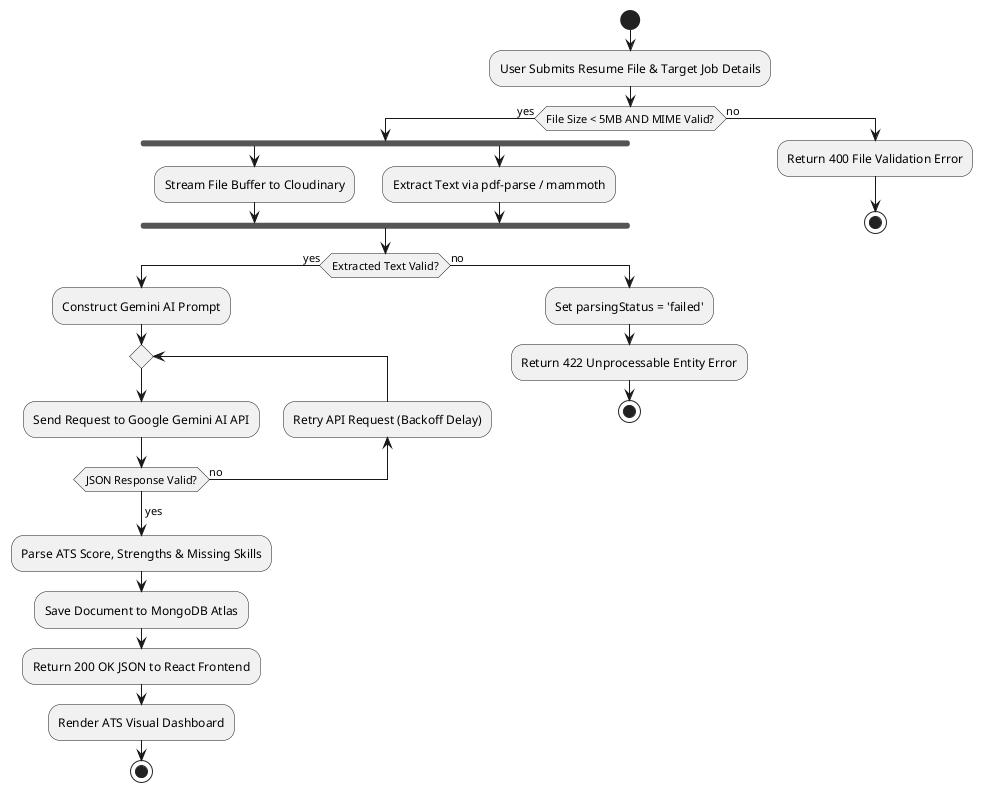

---

## 10. Component Diagram

### Purpose
The **Component Diagram** illustrates the physical software components, component interfaces, dependency wiring, and structural coupling across presentation modules, server controllers, domain services, data models, and cloud provider adapters.

### Component Explanations
- **Frontend Component (`Client SPA`)**: Comprises `AuthModule`, `ResumeModule`, `InterviewModule`, and `DashboardModule`. Communicates over HTTPS via `Axios HTTP Client`.
- **API Gateway Component**: Exposes REST interfaces (`/api/auth`, `/api/resumes`, `/api/dashboard`, `/api/profile`) protected by rate limiters and authentication guards.
- **Controller Component**: Contains `AuthController`, `ResumeController`, `DashboardController`, `ProfileController`.
- **Service Layer Component**: Enforces single responsibility through `ParsingService`, `PdfService`, `GeminiService`, `InterviewAiService`, and `StorageService`.
- **Persistence Adapter Component**: Encapsulates Mongoose models (`UserModel`, `ResumeModel`) interacting with MongoDB Atlas over TCP/IP (`mongodb+srv://`).
- **External API Adapters**: Encapsulates `@google/genai` client SDK for Gemini AI and `cloudinary` SDK for file media streaming.

### Mermaid Diagram
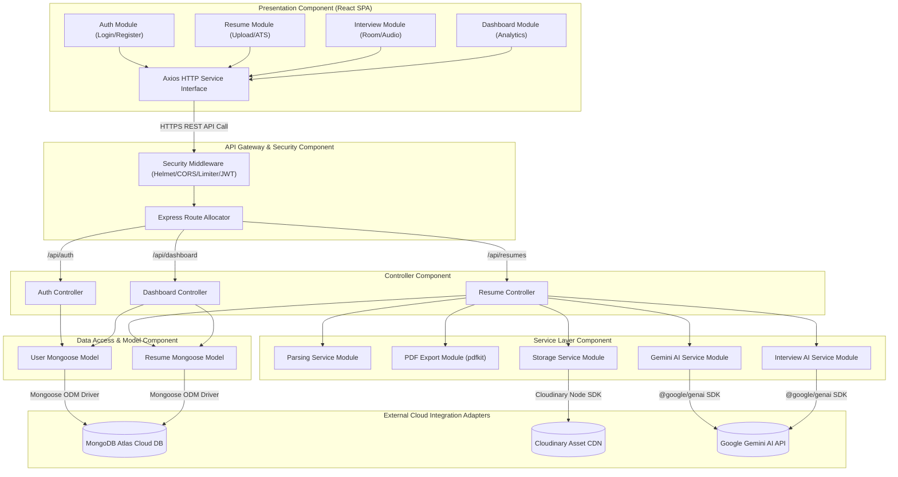

### PlantUML Version
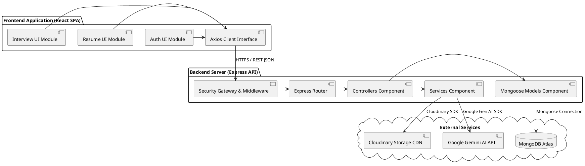

---

## 11. Deployment Diagram

### Purpose
The **Deployment Diagram** specifies the physical deployment architecture, server nodes, hosting environments, network protocols, execution containers, and infrastructure topology of the operational platform.

### Component Explanations
- **Node 1: User Workstation / Mobile Browser**: Client browser running React SPA SPA build assets delivered over HTTPS.
- **Node 2: Vercel Cloud Platform (Frontend Edge CDN)**: Hosts static production build artifacts (`index.html`, JavaScript bundles, CSS assets) with global Edge CDN caching and automated TLS 1.3 certificate management.
- **Node 3: Render Cloud Platform (Backend Managed Service)**: Linux execution node running Node.js runtime (`v18+`/`v20+`) and Express web server listening on port 5000 (proxied via Render HTTPS reverse proxy).
- **Node 4: MongoDB Atlas Managed Cloud Cluster**: Multi-region database cluster running MongoDB engine behind TLS encryption with IP whitelist controls.
- **Node 5: Cloudinary Asset CDN**: Managed media hosting infrastructure serving uploaded PDF files.
- **Node 6: Google Cloud AI Infrastructure**: High-performance AI server farm hosting Gemini 1.5/2.0 Flash LLM models.
- **Network Protocols**:
  - `HTTPS / TLS 1.3`: Encrypted browser-to-frontend and browser-to-backend communication.
  - `mongodb+srv://`: Encrypted TCP database connection string using TLS/SSL credentials.
  - `REST / JSON over HTTPS`: Service-to-service communication with Cloudinary and Google Gemini APIs.

### Mermaid Diagram
```mermaid
graph TD
    subgraph Client_Device ["User Client Node"]
        Browser["Web Browser (Chrome/Firefox/Safari)"]
    end

    subgraph Vercel_Platform ["Vercel Edge Cloud Node"]
        VercelCDN["Vercel Global Edge CDN"]
        ReactStatic["React Production SPA Bundle (Vite)"]
        VercelCDN --- ReactStatic
    end

    subgraph Render_Platform ["Render Managed Service Node"]
        RenderProxy["Render HTTPS Load Balancer"]
        NodeServer["Node.js Application Container"]
        ExpressApp["Express API Runtime (Port 5000)"]

        RenderProxy --> NodeServer
        NodeServer --> ExpressApp
    end

    subgraph Database_Cluster ["MongoDB Atlas Cloud Infrastructure"]
        PrimaryDB[("MongoDB Primary Replica Set Node")]
        SecondaryDB[("MongoDB Secondary Replica Set Node")]
        PrimaryDB <--> SecondaryDB
    end

    subgraph Cloudinary_Cloud ["Cloudinary Asset CDN Node"]
        CloudinaryMedia[("Cloudinary PDF Asset Storage")]
    end

    subgraph Gemini_Cloud ["Google Cloud AI Node"]
        GeminiEngine[("Google Gemini LLM Engine (1.5/2.0 Flash)")]
    end

    %% Network Connections
    Browser -- "1. HTTPS (Port 443) / Fetch SPA Build" --> VercelCDN
    Browser -- "2. REST API / HTTPS (TLS 1.3)" --> RenderProxy
    ExpressApp -- "3. mongodb+srv:// (TLS/SSL Encrypted TCP)" --> PrimaryDB
    ExpressApp -- "4. HTTPS REST SDK Calls" --> CloudinaryMedia
    ExpressApp -- "5. HTTPS REST SDK Calls (@google/genai)" --> GeminiEngine
```

### PlantUML Version
```plantuml
@startuml Deployment_Diagram
node "User Desktop / Mobile Node" {
  node "Web Browser" {
    artifact "React Single Page Application" as SPA
  }
}

node "Vercel Edge Network" {
  node "Edge CDN Node" {
    artifact "Vite Static Build Bundle" as StaticBundle
  }
}

node "Render Cloud Platform" {
  node "Linux Application Node" {
    component "Node.js Runtime Environment" {
      component "Express Web Application Server" as ExpressApp
    }
  }
}

node "MongoDB Atlas Cloud" {
  database "MongoDB Database Cluster" as MongoCluster
}

node "Cloudinary Cloud Infrastructure" {
  component "Media Storage CDN" as CloudinaryCDN
}

node "Google Cloud Infrastructure" {
  component "Gemini AI LLM API Node" as GeminiNode
}

SPA ..> StaticBundle : HTTPS Static Fetch (Port 443)
SPA --> ExpressApp : HTTPS REST API Calls (TLS 1.3)
ExpressApp --> MongoCluster : Protocol: mongodb+srv:// (Port 27017)
ExpressApp --> CloudinaryCDN : HTTPS API Stream Upload
ExpressApp --> GeminiNode : HTTPS API Prompt Calls
@enduml
```

---

## Conclusion & Architectural Conformance Verification

This **System Architecture & UML Technical Documentation** completely and accurately reflects the implemented codebase of the **AI Resume Analyzer & Interview Coach**. 

### Conformance Summary
1. **Consistency**: Every class, method, data attribute, process, and node in this document directly maps to actual backend controllers, middleware, services, Mongoose models, and React frontend routes in the project workspace.
2. **Standardization**: All diagrams adhere strictly to standard UML 2.5 conventions, Data Flow Diagram rules, Entity-Relationship specifications, and clean syntax for both **Mermaid** and **PlantUML**.
3. **Quality**: Built to meet academic requirements for B.Tech Computer Science Engineering thesis submissions as well as technical standards expected in software engineering industry design reviews.
